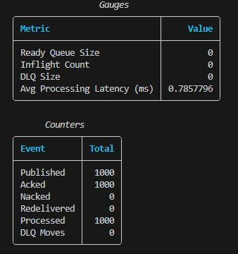
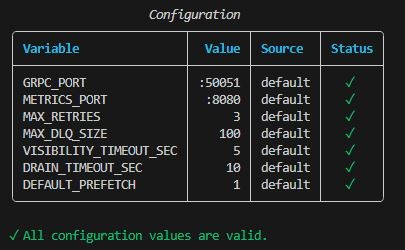
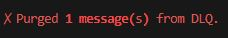
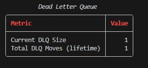
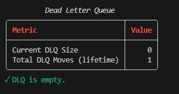

# broker-cli

Python admin CLI for [mini-go-broker](../README.md).  
Provides observability and operational control via the broker's HTTP metrics endpoint.

---

## Install

```bash
cd cli
pip install -r requirements.txt
```

---

## Commands

### `metrics`
Display a full broker metrics snapshot — gauges and counters.

```bash
python broker_cli.py metrics
```

---

### `health`
Check broker health against configurable thresholds. Exits non-zero on warn/critical — CI/CD and monitoring friendly.

```bash
python broker_cli.py health
```

Exit codes:
- `0` → OK
- `1` → WARN
- `2` → CRITICAL

---

### `dlq-inspect`
Inspect Dead Letter Queue status.

```bash
python broker_cli.py dlq-inspect
```

---

### `config-validate`
Validate broker environment variable configuration locally.  
Checks types, value constraints, and cross-variable logic (e.g. drain timeout vs visibility timeout).

```bash
python broker_cli.py config-validate
```

### `dlq-replay`
Replay all DLQ messages back into the ready queue. Useful after a bug fix to reprocess failed messages.
```bash
python broker_cli.py dlq-replay
```

---

### `dlq-purge`
Permanently delete all messages from the Dead Letter Queue.
```bash
python broker_cli.py dlq-purge
```


---

## Configuration

| Environment Variable        | Default     | Description                        |
|-----------------------------|-------------|------------------------------------|
| `BROKER_HOST`               | `localhost`  | Broker host                       |
| `BROKER_METRICS_PORT`       | `8080`       | Metrics server port               |
| `HEALTH_DLQ_WARN`           | `10`         | DLQ size warning threshold        |
| `HEALTH_DLQ_CRIT`           | `50`         | DLQ size critical threshold       |
| `HEALTH_INFLIGHT_WARN`      | `100`        | Inflight count warning threshold  |
| `HEALTH_LATENCY_WARN_MS`    | `100.0`      | Avg latency warning threshold     |

---

## Global Flags

```bash
python broker_cli.py --host localhost --port 8080 <command>
```

---

## Design Notes

This CLI targets observability and operational control only.  
Publishing is intentionally excluded — that is the producer's responsibility.  
`grpcurl` remains the natural interface for direct gRPC interaction (see root README).

## Screenshots





### before dlq replay


### after dlq replay

